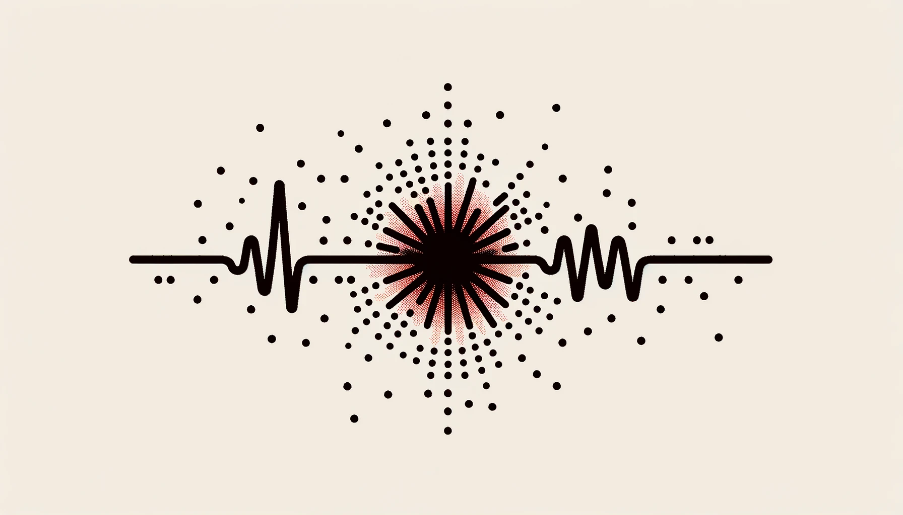

<p align="center">
  
  <h1 align="center">Time Series Robustness</h1>
</p>

<p align="center">
  <a href="https://GitHub.com/joshuawe/time-series-robustness/commits">
    
  </a>
  <a href="https://github.com/joshuawe/time-series-robustness/graphs/contributors">
    
  </a>
  <a href="https://GitHub.com/joshuawe/time-series-robustness/issues/">
    
  </a>
  <a href="https://github.com/joshuawe/time-series-robustness/blob/main/LICENSE">
    
  </a>
</p>

# About

We analyze the robustness of time series for Human Activity Recognition for Smartphones.
How can adversaries with malicious intent manipulate the recognized activities?

To use and reproduce clone this repository and then run the following command:
```bash
pip install -e .
```

# Dataset

# Methods

# Results

# Sources

# Contributors
<a href="https://github.com/joshuawe/time-series-robustness/graphs/contributors">
    
</a>
